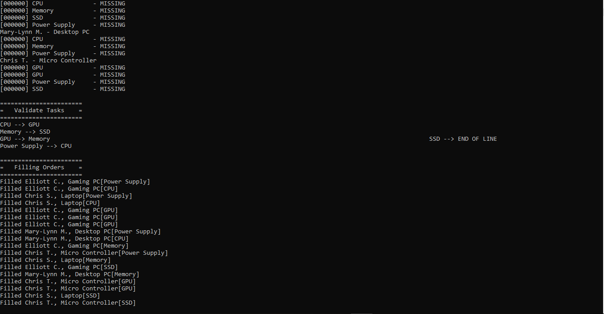

# Assembly Line Manager System

Designed a console application using C++ 

## Description

This application interacts with text files to display a list of detailed information of supplies. Any finance department can use this application to quickly check the prices of the supplies bought by the IT team using this application.

## Images

the first image shows information of a computer's components. The quantity, description.

the second image shows information of users who bought the computer and their components.

the third image shows information of components that are all filled up. This is referred from a txt file.

shows all the components that were ordered in a complete order format. All the orders are filled and the inventory capacity is updated .
